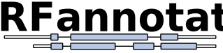

<p align="center">
  
</p>

# ORFannotate

`ORFannotate` is a modular pipeline that predicts open reading frames (ORFs), inserts accurate CDS features into GTF/GFF annotations and produces transcript-level summary that includes coding class, Kozak context, UTR lengths and an NMD flag. It is intended for rapid, reproducible analysis of both long-read and short-read transcriptomes.

---

## Features
- Extract transcript sequences from a GTF/GFF and genome FASTA
- Predict and score ORFs using [`CPAT`](https://cpat.readthedocs.io/en/latest/#introduction)
- Annotate GTF/GFF files with CDS features (only for coding transcripts)
- Identify likely NMD targets (simple heuristic)
- Generate a clean, tab-separated summary of ORF and coding properties, including:
  - ORF/CDS length (nt/aa), coding probability
  - Kozak context and strength classification
  - Exon junction structure
  - UTR lengths
  - NMD prediction
- Generate fasta files with transcript, CDS, UTR (5'/3') and protein sequences

---

## Installation

1. Clone the repository:
```
git clone https://github.com/egustavsson/ORFannotate.git
cd ORFannotate
```

2. Create the environment:
```
conda env create -f ORFannotate.conda_env.yml
conda activate ORFannotate
```

> Note: All required tools are installed when creating the environment.

---
## Input

The pipeline requires:

| File           | Format       | Notes                                                                 |
|----------------|--------------|-----------------------------------------------------------------------|
| GTF/GFF file   | `.gtf` or `.gff` | Must contain `transcript` and `exon` features. Transcript IDs should be unique and consistent. |
| Genome FASTA   | `.fa`, `.fasta` | Reference genome matching the GTF. Must have transcript chromosome names matching those in the annotation. |

> [!WARNING]
> Ensure that your GTF includes transcript-level features (not just exons), or the pipeline may skip some records or produce incomplete outputs.

---

## Usage

To see available arguments:
```bash
python ORFannotate.py --help
```
This will print:

```
usage: ORFannotate.py [-h] --gtf GTF --fa FA --outdir OUTDIR [--species {human,mouse,fly,zebrafish}] [--coding-cutoff CODING_CUTOFF]

ORFannotate – predict coding ORFs, annotate GTF, and generate summaries.

required arguments:
  --gtf             Input GTF or GFF file with transcript and exon features
  --fa              Reference genome in FASTA format
  --outdir          Directory to write all outputs

optional arguments:
  --species         Species model to use for CPAT (choices: human, mouse, fly, zebrafish). Default: human
  --coding-cutoff   CPAT probability threshold to classify coding vs noncoding (if not set, default for species is used)
```
To run the full pipeline:
```bash
python ORFannotate.py --gtf annotations.gtf --fa genome.fa --outdir output/
```

**Example:**
```bash
python ORFannotate.py transcripts.gtf genome.fa output/
```

## CPAT Species Support

ORFannotate now supports multiple species using CPAT’s pre-trained models:

| Species    | Hexamer file                  | Logistic model                   | Default cutoff |
|------------|-------------------------------|----------------------------------|----------------|
| Human      | data/Human_Hexamer.tsv        | data/Human_logitModel.RData      | 0.364          |
| Mouse      | data/Mouse_Hexamer.tsv        | data/Mouse_logitModel.RData      | 0.44           |
| Fly        | data/Fly_Hexamer.tsv          | data/Fly_logitModel.RData        | 0.39           |
| Zebrafish  | data/Zebrafish_Hexamer.tsv    | data/Zebrafish_logitModel.RData  | 0.38           |

Use the `--species` argument to select the appropriate model. If `--coding-cutoff` is not specified, the pipeline will use the default cutoff for the selected species.

> [!NOTE]
> ***Training or Updating CPAT Models***
>
> You can train your own CPAT models, either for unsupported species or to update the model for an existing species using improved coding and noncoding transcript sets.
> This requires building a custom hexamer frequency table and logistic regression model.
> 
> Refer to the [CPAT documentation](https://cpat.readthedocs.io/en/latest/#training-a-custom-model) for detailed instructions.


After a successful run, the following files will be saved in `<output_dir>`:

| **File**                      | **Description**                                                  |
|-------------------------------|------------------------------------------------------------------|
| `transcripts.fa`              | FASTA file of full transcript sequences                          |
| `CPAT/cpat.ORF_prob.tsv`      | CPAT output for the top 5 ORF per transcript                     |
| `CPAT/cpat.ORF_prob.best.tsv` | CPAT output for the best ORF per transcript                      |
| `CPAT/cpat_debug.tsv`         | Full CPAT-scored ORFs (optional debug output)                    |
| `CPAT/CPAT_run_info.log`      | Full CPAT command log                                            |
| `CPAT/CPAT.log`               | CPAT runtime messages                                            |
| `cds.fa`                      | FASTA of predicted coding sequences for coding transcripts       |
| `protein.fa`                  | FASTA of protein sequences translated from predicted CDS         |
| `utr5.fa`                     | FASTA of 5′ UTRs for coding transcripts (if present)             |
| `utr3.fa`                     | FASTA of 3′ UTRs for coding transcripts (if present)             |
| `ORFannotate_annotated.gtf`   | GTF with predicted CDS features added to coding transcripts      |
| `ORFannotate_summary.tsv`     | Final summary table with ORF, CDS, UTR, NMD, and other features  |
| `ORFannotate.log`             | General pipeline log                                             |


> FASTA files are only generated for transcripts classified as coding. UTRs are only included if valid regions exist upstream or downstream of the predicted ORF.


## Summary Output Fields

The final output summary file `ORFannotate_summary.tsv` contains one row per transcript and includes:

| Column              | Description |
|---------------------|-------------|
| `transcript_id`     | Transcript identifier |
| `gene_id`           | Associated gene ID |
| `chrom`             | Chromosome name |
| `strand`            | `+` or `-` |
| `transcript_start`  | Transcript start position (genomic) |
| `transcript_end`    | Transcript end position (genomic) |
| `has_orf`           | `TRUE` if an ORF was predicted, `FALSE` otherwise |
| `orf_nt_len`        | ORF length in nucleotides (only if coding) |
| `orf_aa_len`        | ORF length in amino acids (only if coding) |
| `coding_prob`       | CPAT-predicted coding probability |
| `coding_class`      | `coding` or `noncoding` based on cutoff |
| `junction_count`    | Number of exon–exon junctions |
| `stop_to_last_EJ`   | Distance from stop codon to last exon junction |
| `NMD_sensitive`     | `TRUE` if predicted to undergo NMD, else `FALSE` |
| `kozak_strength`    | `strong`, `moderate`, `weak`, or `NA` (only if coding) |
| `kozak_sequence`    | Kozak sequence around start codon (if available) |
| `utr5_nt_len`       | 5′ UTR length in nucleotides (only if coding) |
| `utr3_nt_len`       | 3′ UTR length in nucleotides (only if coding) |

---

## Kozak Sequence Scoring

The Kozak consensus sequence plays a role in translation initiation efficiency. For each predicted coding transcript, `ORFannotate` extracts a 10-nucleotide sequence surrounding the start codon (positions −6 to +4) and classifies the Kozak strength:

**Consensus:**
```
gccRccAUGG
      ^^^
```

- R = A or G
- Position −3 (relative to start codon) is most critical
- Position +4 (immediately after AUG) also contributes

**Classification:**

| Position −3 | Position +4 | Strength   |
|-------------|-------------|------------|
| A or G      | G           | **strong** |
| A or G      | not G       | moderate   |
| not A/G     | G           | moderate   |
| not A/G     | not G       | weak       |

If the sequence is too short to evaluate, strength is recorded as `"NA"`.

---

## NMD Prediction
`ORFannotate` predicts nonsense-mediated decay (NMD) susceptibility using a simple and widely accepted heuristic:

>A transcript is considered NMD-sensitive if the stop codon lies more than 50 nucleotides upstream of the last exon–exon junction.

This conservative approach is fast and works well for general transcriptome-level analyses, but may not capture all context-dependent cases.

The following output column is provided in the summary:

NMD_sensitive: "TRUE" if the transcript meets the NMD rule, "FALSE" otherwise.

## Directory Structure

```
ORFannotate/
├── ORFannotate.py                # Main script (entry point)
├── ORFannotate.conda_env.yml     # Conda environment file
├── orfannotate/                  # Modular Python package
│   ├── __init__.py
│   ├── transcript_extraction.py
│   ├── orf_prediction.py
│   ├── gtf_annotation.py
│   ├── nmd.py
│   ├── kozak.py
│   ├── orf_filter.py
│   └── summarise.py
|
├── tests/                    # Unit tests (pytest)
│   ├── test_imports.py
│   ├── test_kozak.py
│   ├── test_nmd.py
│   └── test_orf_filter.py
│
├── data/                     # CPAT model files (hexamer and logitModel)
│   ├── Human_Hexamer.tsv
│   |── Human_logitModel.RData
│   └── ...
│
├── docs/
│   └── logo.svg
│
├── LICENSE
└── README.md
```

## License
This project is licensed under the GPLv3 License. See `LICENSE` for details.

## Acknowledgements
- [CPAT](https://github.com/urmi-21/orfipy)
- [gffutils](https://github.com/daler/gffutils)
- [Biopython](https://biopython.org/)
- [gffread](https://github.com/gpertea/gffread)
